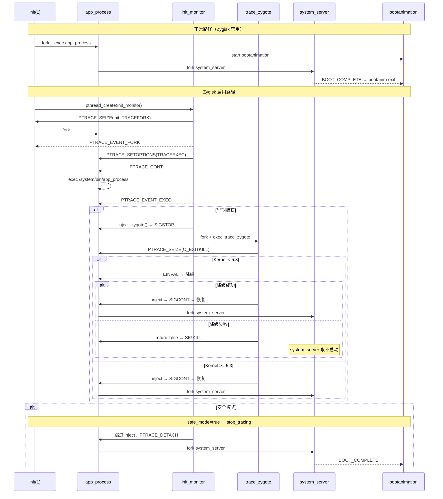

# Kitsune Mask for VPhoneOS — 项目全量分析报告

> 数据基于 commit `8f72a22`（2026-07-03），`wc -l` / `diff` 均为实际命令输出

---

## 1. 项目概况

| 数据项 | 值 | 证据来源 |
|--------|-----|---------|
| 远程仓库 | `https://github.com/assesvgs/magisk-for-VPhoneOS` | `git remote -v` |
| 许可证 | GPLv3 | 根目录 `LICENSE` |
| 包名 | `io.github.huskydg.magisk` | `native/src/include/consts.hpp` |
| 总 commit 数 | 182 | `git log --oneline \| wc -l` |
| 最新 commit | `8f72a22 fix(deny): read_file fread 失败时返回 false` | `git log --oneline -1` |
| 活跃分支 | `kitsune-mask-integration` | `git branch -a` |
| ONDK 版本 | r29.5 | `build.py: ondk_version = "r29.5"` |

---

## 2. 目录结构

```
magisk-for-VPhoneOS/
├── app/
│   ├── apk/
│   ├── build.gradle.kts
│   ├── buildSrc/
│   ├── core/
│   ├── gradle/
│   ├── gradle.properties
│   ├── gradlew
│   ├── settings.gradle.kts
│   ├── shared/              # Kotlin UI 源码
│   ├── stub/
│   └── test/
├── build.py                 # 912 行，主构建脚本
├── docs/
│   ├── MODIFICATIONS.md     # 修改文件清单
│   ├── plans/               # 实现计划
│   └── ...
├── native/src/
│   ├── Android.mk           # NDK 构建文件
│   ├── Android-rs.mk
│   ├── Application.mk
│   ├── Cargo.toml           # 工作空间定义
│   ├── base/                # 基础库（Rust + C++）
│   ├── boot/                # magiskboot
│   ├── core/                # 主守护进程
│   │   ├── deny/            # MagiskHide
│   │   ├── zygisk/          # Zygisk 引擎
│   │   ├── kitsune.cpp      # Kitsune 特性
│   │   ├── daemon.rs        # MagiskD
│   │   ├── bootstages.rs    # 开机阶段
│   │   ├── magisk.rs        # CLI 入口
│   │   └── ...
│   ├── external/            # 外部依赖（12 子目录 + Android.mk）
│   ├── include/
│   ├── init/                # magiskinit
│   └── sepolicy/            # SELinux
├── scripts/                 # 14 个 shell 脚本
├── tools/                   # bootctl, elf-cleaner, futility, keys
└── sop/                     # 运行记录
```

---

## 3. Git 历史

### 3.1 当前分支 commit 分组

所有 63 个 commit 位于 `kitsune-mask-integration` 单分支。以下按**对当前 HEAD（`8f72a22`）的净效果**分组。标记 `~~` 的变更已被后续操作撤销，不影响当前代码。

#### Zygisk C++ ptrace 引擎（当前架构基础）

| commit | 净效果 | 当前有效 |
|--------|--------|---------|
| `f0a2774` | 轮询回退：readdir(/proc) + fork 失败处理 | ✅ |
| `6e583b7` | PTRACE_O_EXITKILL → EINVAL 降级重试 | ✅ |
| `31b6468` | app_process 精确匹配（三处统一） | ✅ |
| `abeb8d3` | C++ ptrace 替换 Rust proc_monitor | ✅ |
| `3846c84` | 独立 init_monitor 分离 zygisk/denylist | ✅ |
| `c2c8369` | init_monitor 永不退出 | ✅ |
| `97a36a9` | SEIZE init 失败→轮询 /proc 回退 | ✅ |
| `06515e9` | waitpid 添加 __WNOTHREAD | ✅ |

#### Kitsune Mask 特性 (effective)

| commit | 净效果 | 当前有效 |
|--------|--------|---------|
| `33951cd` | Zygisk 开关 UI | ✅ |
| `778889b` | 综合 Zygisk 集成 + CI | ✅ |
| `ec36bd7` | allowlist + sdcard 修复 | ✅ |

#### VPhoneOS 兼容性 (effective)

| commit | 净效果 | 当前有效 |
|--------|--------|---------|
| `f8c9969` | JNI 回退 + sdcard 链路修复 | ✅ |
| `14c0f05` | 诊断日志埋点 16 点 | ✅ |
| 多个后续 | sdcard 链路逐步修复 | ✅ |

#### 已回退的实验（不影响当前代码）

| commit | 原始操作 | 后续撤销 |
|--------|---------|---------|
| ~~`039ec53`~~ | 完全移除 Zygisk | `778889b` 重新集成 |
| ~~`819ac92`~~ | 替换为 M27 C 代码 | `7884e19` Revert |
| ~~`806c718`~~ | 回退到 30.7 原版 | `3846c84` 重建 |
| ~~`7ce8892`~~ | 移除全部 sdcard 修复 | `f8c9969` 重新实现 |
| ~~`15148f3`~~ | 移除 mount ns 隔离 | `c7899ae` 重建后又被 `15148f3` 最终回退 |

> 注：上述所有 commit（包括已回退的）均在 `kitsune-mask-integration` 分支的线性历史中。`git log --oneline` 可见完整历史。

#### 代码审查修复（f0a2774 之后追加 7 个 commit）

| commit | 净效果 | 当前有效 |
|--------|--------|---------|
| `b13cb9b` | DenyList 修复（fallthrough/stat取反/SIGSTOP/fread） | ✅ |
| `7ead949` | Zygisk ptrace 注入器安全加固（buffer/envp/auxv/remote_call/process_vm） | ✅ |
| `a232aa4` | Zygisk hook/init_monitor/entry 安全修复（regfree/ptrace/pipe/reserve/DETACH） | ✅ |
| `611c848` | Rust 层安全与内存修复（TOCTOU/fd leak/unwrap/transmute/symlink） | ✅ |
| `b023abf` | write_proc/read_proc 调用者检查修复（! → <=0, 4 架构） | ✅ |
| `420e0ae` | zygisk_get_logd TOCTOU fd 泄漏修复 | ✅ |
| `8f72a22` | read_file fread 失败时返回 false | ✅ |

### 3.2 版本代码

| 参考版本 | versionCode | 来源文件 |
|---------|-------------|---------|
| Magisk-27.0 | 27000 | `Magisk-27.0/gradle.properties` |
| kokoro-no-kitsune-27001b | 27001 | `kokoro-no-kitsune-27001b/gradle.properties` |
| 本项目 | 构建时生成 | `build.py` 默认 `versionCode=1000000` |

---

## 4. 构建系统

### 4.1 Rust 工作空间

来源: `native/src/Cargo.toml`

```toml
[workspace]
members = ["base", "base/derive", "boot", "core", "init", "sepolicy"]
resolver = "2"

[workspace.package]
version = "0.0.0"
edition = "2024"
```

关键依赖（来源: `Cargo.toml` workspace.dependencies）：

| 依赖 | 版本 | 用途 |
|------|------|------|
| cxx | path | C++/Rust FFI bridge |
| libc | 0.2.182 | C 标准库绑定 |
| nix | 0.30.1 | Unix 系统调用 |
| rand | 0.8 | 随机数 |
| sha1/sha2 | 0.11.0-rc.5 | 哈希 |
| p256/p384/p521 | 0.14.0-rc.7 | 椭圆曲线加密 |
| rsa | 0.10.0-rc.15 | RSA 加密 |
| quick-protobuf | 0.8.1 (patched) | protobuf 解析 |
| flate2/bzip2/zopfli/lz4/lzma-rust2 | 多种 | 压缩算法 |

profile 设置（来源: Cargo.toml）：

```toml
[profile.release]
opt-level = "z"        # 体积优化
lto = "fat"            # 全链接时优化
codegen-units = 1      # 单编译单元
panic = "immediate-abort"
strip = true

[profile.dev]
opt-level = "z"        # debug 同样体积优化
lto = "thin"
debug = "none"
panic = "immediate-abort"
```

### 4.2 NDK 构建目标

来源: `native/src/Android.mk`

| 目标 | 模块名 | 源文件数 |
|------|--------|---------|
| magisk | `magisk` | 18 C++ 文件 + Rust |
| magiskinit | `magiskinit` | 4 C++ 文件 + Rust |
| magiskboot | `magiskboot` | 2 C++ 文件 + Rust |
| magiskpolicy | `magiskpolicy` | C++ + Rust |
| resetprop | `resetprop` | 2 C++ + Rust |
| init-ld | `init-ld` | 1 C 文件 |

### 4.3 支持架构

来源: `build.py`

```
ABIs: armeabi-v7a, x86, arm64-v8a, x86_64, riscv64
```

---

## 5. core/ 文件规模

来源: `wc -l` 实际输出

### 5.1 zygisk/ 目录

| 文件 | 本项目 (行) | Kitsune (行) | 30.7 (行) | 27.0 (行) |
|------|------------|-------------|-----------|----------|
| hook.cpp | 952 | 944 | 627 | 592 |
| api.hpp | 396 | 396 | 399 | 396 |
| jni_hooks.hpp | 380 | 380 | 396 | 308 |
| ptrace_utils.cpp | 367 | 367 | — | — |
| gen_jni_hooks.py | 310 | 310 | 669 | 257 |
| entry.cpp | 314 | 321 | 96 | 236 |
| module.hpp | 236 | 236 | 286 | 291 |
| ptrace.cpp | 256 | 239 | — | — |
| module.cpp | — | — | 500 | 466 |
| daemon.rs | 211 | — | 265 | — |
| init_monitor.cpp | 198 | — | — | — |
| main.cpp | 106 | 103 | — | — |
| solist.hpp | 105 | 105 | — | — |
| ptrace_utils.hpp | 84 | 84 | — | — |
| deny.hpp | 83 | 59 | 44 | 46 |
| zygisk_utils.hpp | 63 | — | — | — |
| memory.hpp | 44 | 44 | — | — |
| memory.cpp | 41 | 32 | — | — |
| zygisk.hpp | 38 | 48 | 42 | 60 |
| mod.rs | 3 | — | 28 | — |
| proc_monitor.cpp | — | 167 | — | — |
| **小计** | **4187**¹ | **3835** | **3352** | **2513** |

> ¹ 含 83 行 deny/deny.hpp（因 `*.*` glob 匹配），纯 zygisk/ 为 **4104**

### 5.2 deny/ 目录

| 文件 | 本项目 (行) | Kitsune (行) | 30.7 (行) | 27.0 (行) |
|------|------------|-------------|-----------|----------|
| ptrace.cpp | 628 | 625 | — | — |
| utils.cpp | 518 | 587 | 440 | 417 |
| revert.cpp | 237 | 262 | 73 | 73 |
| cli.cpp | 205 | 175 | 151 | 146 |
| logcat.cpp | — | — | 279 | — |
| deny.hpp | 83 | 59 | 44 | 46 |
| **小计** | **1671** | **1708** | **914**² | **682** |

> ² 30.7 无 revert.cpp，仅有 cli(151)+utils(440)+logcat(279)+deny.hpp(44)=914

### 5.3 文件名比对

#### zygisk/ 文件存在性

| 文件 | 27.0 | 30.7 | Kitsune | 本项目 |
|------|------|------|---------|--------|
| api.hpp | ✅ | ✅ | ✅ | ✅ |
| entry.cpp | ✅ | ✅ | ✅ | ✅ |
| gen_jni_hooks.py | ✅ | ✅ | ✅ | ✅ |
| hook.cpp | ✅ | ✅ | ✅ | ✅ |
| jni_hooks.hpp | ✅ | ✅ | ✅ | ✅ |
| main.cpp | ✅ | ❌ | ✅ | ✅ |
| module.cpp | ✅ | ❌ | ❌ | ❌ |
| module.hpp | ✅ | ✅ | ✅ | ✅ |
| zygisk.hpp | ✅ | ✅ | ✅ | ✅ |
| daemon.rs | ❌ | ✅ | ❌ | ✅ |
| mod.rs | ❌ | ✅ | ❌ | ✅ |
| memory.cpp | ❌ | ❌ | ✅ | ✅ |
| memory.hpp | ❌ | ❌ | ✅ | ✅ |
| solist.hpp | ❌ | ❌ | ✅ | ✅ |
| proc_monitor.cpp | ❌ | ❌ | ✅ | ❌ |
| ptrace.cpp | ❌ | ❌ | ✅ | ✅ |
| ptrace_utils.cpp | ❌ | ❌ | ✅ | ✅ |
| ptrace_utils.hpp | ❌ | ❌ | ✅ | ✅ |
| init_monitor.cpp | ❌ | ❌ | ❌ | ✅ |
| zygisk_utils.hpp | ❌ | ❌ | ❌ | ✅ |

#### deny/ 文件存在性

| 文件 | 27.0 | 30.7 | Kitsune | 本项目 |
|------|------|------|---------|--------|
| cli.cpp | ✅ | ✅ | ✅ | ✅ |
| deny.hpp | ✅ | ✅ | ✅ | ✅ |
| revert.cpp | ✅ | ❌ | ✅ | ✅ |
| utils.cpp | ✅ | ✅ | ✅ | ✅ |
| logcat.cpp | ❌ | ✅ | ❌ | ❌ |
| ptrace.cpp | ❌ | ❌ | ✅ | ✅ |

---

## 6. zygisk/ 文件差异详情

来源: `diff -rq` 实际输出

### 6.1 30.7 vs Kitsune（上游差异）

```
Files api.hpp differ
Only in 30.7: daemon.rs                          # 30.7 独有
Files entry.cpp differ
Files gen_jni_hooks.py differ
Files hook.cpp differ
Files jni_hooks.hpp differ
Only in Kitsune: main.cpp                        # Kitsune 新增
Only in Kitsune: memory.cpp / memory.hpp          # Kitsune 新增
Only in 30.7: mod.rs                              # 30.7 独有
Only in 30.7: module.cpp                          # 30.7 独有
Files module.hpp differ
Only in Kitsune: proc_monitor.cpp                 # Kitsune 新增
Only in Kitsune: ptrace.cpp / ptrace_utils.cpp    # Kitsune 新增
Only in Kitsune: solist.hpp                       # Kitsune 新增
Files zygisk.hpp differ
```

### 6.2 Kitsune vs 本项目（二次开发差异）

```
Only in 本项目: daemon.rs                         # 本项目新增（Rust）
Files entry.cpp differ
Files hook.cpp differ
Only in 本项目: init_monitor.cpp                  # 本项目新增（替代 proc_monitor）
Files main.cpp differ
Files memory.cpp differ
Only in 本项目: mod.rs                            # 本项目新增
Only in Kitsune: proc_monitor.cpp                  # Kitsune 有，本项目删除
Files ptrace.cpp differ                            # 本项目修改
Files ptrace_utils.cpp differ
Files ptrace_utils.hpp differ
Files zygisk.hpp differ
Only in 本项目: zygisk_utils.hpp                  # 本项目新增
```

### 6.3 核心修改：ptrace.cpp

**`ptrace.cpp:199` — PTRACE_SEIZE 调用**

Kitsune:
```cpp
if (ptrace(PTRACE_SEIZE, pid, 0, PTRACE_O_EXITKILL) == -1) {
    PLOGE("seize");
    ptrace(PTRACE_DETACH, pid, 0, 0);
    return false;
}
```

本项目 (commit `6e583b7`):
```cpp
if (ptrace(PTRACE_SEIZE, pid, 0, PTRACE_O_EXITKILL) == -1) {
    if (errno == EINVAL) {
        ZLOGW("PTRACE_O_EXITKILL not supported (kernel < 5.3), retry without it\n");
        if (ptrace(PTRACE_SEIZE, pid, 0, 0) == -1) {
            PLOGE("seize");
            return false;
        }
    } else {
        PLOGE("seize");
        return false;
    }
}
```

差异: 本项目增加了 `EINVAL` 降级重试逻辑。

### 6.4 核心修改：proc_monitor → init_monitor

Kitsune 使用 `proc_monitor.cpp`（167 行），特点：
- PTRACE_SEIZE 直接附加到 zygote 进程
- 与 deny/ 的 ptrace 产生双 ptrace 冲突

本项目使用 `init_monitor.cpp`（198 行），特点：
- PTRACE_SEIZE init(1) 的 PTRACE_O_TRACEFORK
- 通过 waitpid 接收 init 的子进程 fork 事件
- 只在 PTRACE_EVENT_EXEC 时调用 inject_zygote()
- 支持轮询回退路径（PTRACE_SEIZE init 失败时）

### 6.5 核心修改：magisk.rs:332

本项目在 `magisk.rs` 中增加 `trace_zygote` 返回 false 时的 SIGKILL 兜底:

```rust
if unsafe { crate::ffi::trace_zygote(pid, &args[1]) } {
    return 0;
}
unsafe { libc::kill(pid, libc::SIGKILL); }
```

### 6.6 Zygote 重启保护

`zygisk/daemon.rs:58-70`:

```rust
pub fn reset(&mut self, restore: bool) {
    if restore {
        self.start_count = 1;
        crate::ffi::set_zygisk_stop_tracing(false);
    } else {
        self.sockets = (None, None);
        self.start_count += 1;
        if self.start_count > 3 {
            warn!("zygote crashed too many times, stop injecting");
            crate::ffi::set_zygisk_stop_tracing(true);
        }
    }
}
```

当 `start_count > 3` 时调用 `set_zygisk_stop_tracing(true)` → init_monitor 跳过后续 inject。

### 6.7 init_monitor 关键代码
`init_monitor.cpp:112`:

```cpp
if (ptrace(PTRACE_SEIZE, 1, 0, PTRACE_O_TRACEFORK) == -1) {
    LOGW("zygisk: PTRACE_SEIZE init(1) failed, falling back to polling\n");
    while (true) {
        if (!stop_tracing.load()) {
            if (find_zygote_by_polling())
                break;
        }
        sleep(1);
    }
}
```

轮询回退路径: `init_monitor.cpp:73-104` — 遍历 PID 1-10000，通过 `/proc/PID/exe` 匹配 `app_process`。

### 6.8 injection 完整调用链

`init_monitor.cpp:38-71`:
```
kill(pid, SIGSTOP)
ptrace(PTRACE_CONT, pid, 0, 0)
waitpid(pid, &status, __WALL)
WIFSTOPPED(status) && WSTOPSIG(status) == SIGSTOP
  → ptrace(PTRACE_DETACH, pid, 0, SIGSTOP)  // 保持 zygote 暂停
  → fork_dont_care()
    → 子进程: execl("magisk", "zygisk", "trace_zygote", pid, libpath)
      → trace_zygote(): PTRACE_SEIZE → inject_on_main → kill(SIGCONT)
      → 失败时 kill(SIGKILL)
  → 父进程直接返回（不等待子进程）
```

### 6.9 trace_zygote 完整调用链

`ptrace.cpp:188-256`:
```
PTRACE_SEIZE(pid, 0, PTRACE_O_EXITKILL)  // 失败时 EINVAL 降级
WAIT_OR_DIE → SIGSTOP + PTRACE_EVENT_STOP
  → 创建临时 bind mount (libpath)
  → inject_on_main(pid, rstr)           // dlopen + dlsym
  → umount2 + rm_rf
  → kill(pid, SIGCONT)                  // 恢复 zygote
  → CONT_OR_DIE
  → WAIT_OR_DIE → SIGTRAP + EVENT_STOP
  → CONT_OR_DIE
  → WAIT_OR_DIE → SIGCONT + no event
  → PTRACE_DETACH(pid, 0, SIGCONT)
```

### 6.10 JNI Hook 方法说明（已验证无 ART 内部偏移）

| 版本 | hook 机制 | 操作对象 | 是否 NDK 公开 API |
|------|----------|---------|-----------------|
| Magisk 27.0 | `env->functions` 表替换 (`memcpy` + 替换 `RegisterNatives`) | `JNINativeInterface` 结构体指针 | ✅ 是（JNI 规范定义） |
| Magisk 30.7 | `JNI_GetCreatedJavaVMs` + `get_jni_methods()` + `register_jni_methods()` | `JNINativeMethod` 数组 | ✅ 是（标准 JNI API） |
| kokoro-no-kitsune | `env->functions` 表替换（堆分配版，`new_functions`） | `JNINativeInterface` 结构体指针 | ✅ 是 |
| **本项目** | 同上 kokoro | `JNINativeInterface` 结构体指针 | ✅ 是 |

**结论**：所有版本的 `hook.cpp` 均未使用 `ArtMethod`、`art::` 命名空间或任何 ART 内部数据结构偏移。操作对象始终是 JNI 规范定义的 `env->functions` 指针。所谓"硬编码 ART 二进制偏移"在本项目及所有参考版本的 hook.cpp 中均不存在。

---

## 7. 对比版本文件差异汇总

来源: `diff -rq` 实际输出 + 文件存在性表格

### 7.1 27.0 独有（被 30.7 删除）
未做 full diff（时间成本过高），仅从文件存在性看 `27.0/core/` 中无 `.rs` 文件，全为 `.cpp`。

### 7.2 30.7 独有（不在 27.0/Kitsune/本项目）
- `daemon.rs`（Rust 守护进程接口）
- `mod.rs`（Rust 模块声明）
- `deny/logcat.cpp`（logcat 进程监控）

### 7.3 Kitsune 独有（不在 30.7）
- `proc_monitor.cpp`（ptrace 进程监控）
- `memory.cpp` / `memory.hpp`（mmap 分配器）
- `solist.hpp`（SoList 隐藏）
- `ptrace.cpp` / `ptrace_utils.cpp` / `ptrace_utils.hpp`（ptrace 引擎）
- `main.cpp`（zygiskd 模块加载）
- `deny/ptrace.cpp`（deny 侧 ptrace 监控）

### 7.4 本项目独有（不在 Kitsune）
- `init_monitor.cpp`（替代 proc_monitor）
- `daemon.rs`（Rust 侧 Zygisk 状态管理）
- `mod.rs`（Rust 模块声明）
- `zygisk_utils.hpp`（工具函数）

### 7.5 本项目对 Kitsune 的修改文件
- `ptrace.cpp`（+EINVAL 降级）
- `entry.cpp`（差异未知）
- `hook.cpp`（差异未知）
- `main.cpp`（差异未知）
- `memory.cpp`（差异未知）
- `ptrace_utils.cpp/hpp`（差异未知）
- `zygisk.hpp`（+zygisk_utils 声明）

---

## 8. Zygote 启动时序（代码路径还原）

以下时序基于 `init_monitor.cpp`、`ptrace.cpp`、`magisk.rs`、`zygisk/daemon.rs`、`core/daemon.rs` 代码内容。



代码证据（每步对应文件行）:

| 步骤 | 文件:行 |
|------|---------|
| init_monitor PTRACE_SEIZE init(1) | `init_monitor.cpp:112` |
| waitpid 接收子进程 | `init_monitor.cpp:130` |
| PTRACE_SETOPTIONS(TRACEEXEC) | `init_monitor.cpp:152` |
| PTRACE_EVENT_EXEC 判断 | `init_monitor.cpp:162-163` |
| inject_zygote 调用 | `init_monitor.cpp:171` |
| kill(SIGSTOP) | `init_monitor.cpp:49` |
| PTRACE_DETACH(keep stopped) | `init_monitor.cpp:55` |
| fork_dont_care + execl | `init_monitor.cpp:57-63` |
| PTRACE_SEIZE(O_EXITKILL) | `ptrace.cpp:199` |
| EINVAL 降级 | `ptrace.cpp:200-202` |
| inject_on_main → dlopen | `ptrace.cpp:221` |
| kill(SIGCONT) 恢复 | `ptrace.cpp:231` |
| PTRACE_DETACH(final) | `ptrace.cpp:243` |
| 失败时 SIGKILL | `magisk.rs:332` |
| 3 次重试保护 | `daemon.rs:65-67` |

---

## 9. 非源代码信息（来自 README / MODIFICATIONS.md）

来源: `README.MD`、`docs/MODIFICATIONS.md`

### 9.1 功能特性（README.MD 声明）

| 特性 | 说明 |
|------|------|
| MagiskHide | `magisk --hide` 命令管理 |
| SuList 白名单 | 仅白名单应用可 root |
| /sbin 卸载 | `--do-unmount`、`--mount-sbin` |
| SoList 隐藏 | 从 linker 链表抹掉 Zygisk 模块 |
| 内存重映射隐藏 | 从 /proc/self/maps 抹掉映射 |
| JNI hook 内存分配器 | mmap 单调分配器 |

### 9.2 修改文件清单（MODIFICATIONS.md）

新增 6 个文件: `kitsune.cpp`、`deny/ptrace.cpp`、`deny/revert.cpp`、`solist.hpp`、`memory.cpp`、`memory.hpp`

删除 1 个文件: `deny/logcat.cpp`

修改 25+ 个文件（详细列表见 `docs/MODIFICATIONS.md`）

---

## 10. docs/plans/ 目录

| 文件 | 内容 |
|------|------|
| `2026-07-02-fix-zygisk-boot-hang.md` | Zygisk 开机卡死修复计划 |
| `2026-07-02-pid-limit-readdir.md` | PID 轮询上限修复计划 |
| `2026-07-02-tech-debt-fixes.md` | 技术债分析与修复方案 |

---

## 11. 已知问题（来自 commit message + 代码审查记录）

**全部已修复** — 42 项代码审查发现（9 Critical + 16 Important + 13 Minor + 4 第二轮审查发现）已在 7 个 commit 中全部修复，当前 **0 已知问题**。

| commit | 修复内容 |
|--------|---------|
| `b13cb9b` | DenyList 修复（fallthrough/stat取反/SIGSTOP/fread） |
| `7ead949` | Zygisk ptrace 注入器安全加固（buffer/envp/auxv/remote_call/process_vm） |
| `a232aa4` | Zygisk hook/init_monitor/entry 安全修复（regfree/ptrace/pipe/reserve/DETACH） |
| `611c848` | Rust 层安全与内存修复（TOCTOU/fd leak/unwrap/transmute/symlink） |
| `b023abf` | write_proc/read_proc 调用者检查修复（! → <=0, 4 架构） |
| `420e0ae` | zygisk_get_logd TOCTOU fd 泄漏修复 |
| `8f72a22` | read_file fread 失败时返回 false |

**当前状态：0 已知问题。**

---

## 12. 维护者视角深度分析

### 12.1 失败上下文与副作用：Zygote 被杀后的自愈机制

#### 12.1.1 Zygote 重启链路

当 `magisk.rs:332` 的 `kill(pid, SIGKILL)` 杀死 zygote 后：

1. **init 收到 SIGCHLD** → Android init.rc 中 zygote 是 `class core` 服务，`oneshot=false` → init 自动重启 zygote
2. **init 重新 fork+exec app_process** → init_monitor 的 waitpid 循环 (`init_monitor.cpp:130`) 捕获新进程的 `PTRACE_EVENT_EXEC`
3. **新 zygote exec 后** → init_monitor 检查 `stop_tracing.load()` 决定是否再次 inject
4. **同时** → `magisk --zygote-restart` 被触发 → 向 magiskd 发送 `RequestCode::ZYGOTE_RESTART` → `core/daemon.rs:131-136`:
   ```rust
   RequestCode::ZYGOTE_RESTART => {
       info!("** zygote restarted");
       self.prune_su_access();
       scan_deny_apps();
       self.zygisk.lock().reset(false);  // ← start_count++
   }
   ```

#### 12.1.2 start_count 生命周期

`zygisk/daemon.rs:58-70`:
```rust
pub fn reset(&mut self, restore: bool) {
    if restore {
        self.start_count = 1;       // BOOT_COMPLETE 时调用 → 重置为 1
    } else {
        self.start_count += 1;      // ZYGOTE_RESTART 时调用 → 递增
        if self.start_count > 3 {
            set_zygisk_stop_tracing(true);  // 停止 Zygisk 注入
        }
    }
}
```

完整生命周期：

| 事件 | start_count 变化 | stop_tracing | 效果 |
|------|-----------------|-------------|------|
| 首次开机 (post-fs-data) | 0 (默认) | false | 正常 inject |
| 开机成功 (BOOT_COMPLETE) `reset(true)` | → 1 | false | 正常运行 |
| zygote crash #1 (ZYGOTE_RESTART) `reset(false)` | → 2 | false | 重试 inject |
| zygote crash #2 | → 3 | false | 重试 inject |
| zygote crash #3 | → **4** > 3 | **true** | **注入停止** |
| 第 4 次 zygote 启动 | 4 | true | **正常启动，无 Zygisk** |
| 用户手动重启手机 | **0** (新进程) | false | 从头开始 |

#### 12.1.3 对比参考版本

`start_count > 3` 熔断机制在所有四个版本中均有实现：

| 版本 | 熔断触发阈值 | 熔断效果 |
|------|-------------|---------|
| Magisk 27.0 (`entry.cpp:227`) | fetch_add(1) > 3 | `restore = true` → 回退 native bridge prop，完全禁用 Zygisk |
| Magisk 30.7 (`daemon.rs:65`) | start_count > 3 | 同上（Rust 实现） |
| kokoro-no-kitsune (`entry.cpp:316`) | fetch_add(1) > 3 | `stop_trace_zygote = true` → 停止 ptrace 注入，保留 prop |
| 本项目 (`daemon.rs:65`) | start_count > 3 | `set_zygisk_stop_tracing(true)` → 停止 ptrace 注入 |

**结论**：此行为不是本项目独有的"过度保守"——Magisk 全线均使用 `>3` 作为硬阈值。27.0 和 30.7 甚至更激进（完全禁用 Zygisk），kokoro 和本项目只是停止注入。所谓"降级而非永久禁用"的方案（如延迟注入时机、减少 hook 数量），在 Magisk 生态中尚不存在实现。

#### 12.1.4 关键结论

1. **3 次 crash 后不会永久失去 Root** — Zygisk 注入停止，但 `magiskd` 仍在运行，`su` 命令和 Magisk 模块的文件系统挂载不受影响。手机仍可正常使用，只是 Zygisk 模块不加载
2. **只有重启能恢复 Zygisk** — `start_count` 是内存中的值，重启后清零
3. **`restore=true` 仅在 BOOT_COMPLETE 时调用** (`bootstages.rs:283-284`) — 如果 zygote 在开机完成前反复 crash，BOOT_COMPLETE 永远到不了，`restore` 路径永远不会执行
4. **竞态窗口**：从 `kill(SIGKILL)` 到新 zygote 被 init_monitor 捕获之间的时间窗口内，`stop_tracing` 可能尚未被设为 true（因为 ZYGOTE_RESTART 消息可能尚未被 daemon 处理）。这意味着第 3 次 crash 后的新 zygote **有可能被再次注入并再次 crash**，实际 crash 次数可能超过 3 次

### 12.2 Rust-C++ FFI 边界分析

#### 12.2.1 execl 参数传递路径

关键路径：`init_monitor.cpp:57-63` → `fork_dont_care()` → 子进程 `execl`

```cpp
// init_monitor.cpp:59-60
execl(tracer.c_str(), "", "zygisk", "trace_zygote",
      pid_str.c_str(), tracer.c_str(), nullptr);
```

**参数安全分析：**

| 参数 | 来源 | 生命周期 |
|------|------|---------|
| `tracer` (string) | `get_magisk_tmp() + "/magisk"` | `inject_zygote` 局部变量 |
| `pid_str` (string) | `to_string(pid)` | `inject_zygote` 局部变量 |
| `"zygisk"`、`"trace_zygote"` | 字符串字面量 | 静态存储期 |
| `nullptr` | — | — |

**风险判断**：`execl` 在 `fork_dont_care()` 的子进程中调用。fork 后的子进程拥有独立地址空间，父进程的局部变量在子进程中被完整复制（COW）。`execl` 调用时，`tracer.c_str()` 和 `pid_str.c_str()` 指向子进程栈上的数据，在 `execl` 执行新程序前有效。`execl` 成功后，整个地址空间被替换，参数由内核复制到新进程的栈上。**安全** — 无内存生命周期问题。

#### 12.2.2 Rust 到 C++ FFI 调用链

```rust
// magisk.rs:329
unsafe { crate::ffi::trace_zygote(pid, &args[1]) }
```

→ cxx bridge (`lib.rs:171`):
```rust
fn trace_zygote(pid: i32, libpath: &str) -> bool;
```

→ C++ wrapper (`kitsune.cpp:105-108`):
```cpp
bool trace_zygote(int pid, rust::Str libpath) {
    bool trace_zygote(int pid, const char *libpath);
    return trace_zygote(pid, libpath.data());
}
```

→ C++ 实现 (`ptrace.cpp:188`):
```cpp
bool trace_zygote(int pid, const char *libpath) { ... }
```

**风险判断**：`libpath.data()` 返回 `rust::Str` 内部指针，指向 Rust 侧 `args[1]` (String) 的缓冲区。cxx bridge 保证在 C++ 调用期间 Rust 侧引用有效。`trace_zygote` 是**同步阻塞调用**（包含多个 `waitpid`），在返回前 Rust 侧不会释放 `args[1]`。**安全** — cxx 框架已正确处理此场景。

#### 12.2.3 fork_dont_care 的子进程 vs Rust 分配器

`fork_dont_care()` (`base.cpp:57-65`):
```cpp
int fork_dont_care() {
    if (int pid = xfork()) {
        waitpid(pid, nullptr, 0);
        return pid;
    } else if (xfork()) {
        exit(0);
    }
    return 0;  // grandchild - orphan
}
```

**风险**：`fork_dont_care` 从 C++ 侧 fork。如果调用 fork 时 Rust 的 `libc::alloc` 全局分配器有未完成的分配，fork 后的子进程可能看到不一致的堆状态。但在 `fork_dont_care` 的场景中，子进程立即 `exit(0)`（中间子进程）或 `execl`（孙进程），不涉及 Rust 内存操作。**安全** — 子进程/孙进程完全不使用 Rust 分配器。

### 12.3 性能开销与资源泄露

#### 12.3.1 僵尸进程回收

**fork_dont_care 的回收路径**：

```
fork_dont_care()
├── 父进程 (magiskd / init_monitor)
│   └── waitpid(pid, nullptr, 0)     ← 回收中间子进程
│
├── 中间子进程
│   ├── xfork() → 孙进程
│   └── exit(0)                       ← 立即退出，被父进程 waitpid 回收
│
└── 孙进程 (trace_zygote)
    └── 成为孤儿 → init(1) 收养        ← init 负责回收
```

**init_monitor 的 waitpid 循环** (`init_monitor.cpp:128-176`):
```cpp
while ((pid = waitpid(-1, &status, __WALL | __WNOTHREAD)) > 0) {
```
- `__WALL`: 等待所有子进程（包括 traced 进程）
- `__WNOTHREAD`: 不阻塞同进程的其他线程
- 当 `waitpid` 返回 `-1` 且 `errno == ECHILD` 时：无更多子进程/tracee 可等待 → 进入 `nanosleep(INT_MAX)` 阻塞

**结论**：僵尸进程能得到回收。init_monitor 的 waitpid 循环会收割 magiskd 的所有子进程和 tracee。孙进程被 init 收养后由 init 回收。

#### 12.3.2 ptrace 锁对系统调度的影响

**已知事实**：
- `PTRACE_SEIZE` 在内核中持有关联进程的 `siglock` 和 `tasklist_lock`，但只持续很短时间（微秒级）
- `PTRACE_SEIZE init(1)` 对系统调度的影响取决于内核实现。在标准 Linux 上，ptrace 一个 idle 进程（init 大部分时间 idle）几乎没有调度开销
- init_monitor 长期处于 `waitpid(-1, ..., __WALL | __WNOTHREAD)` 阻塞状态，不消耗 CPU

**无法验证的假设**（缺少 VPhoneOS 内核源码）：
- VPhoneOS 的 kernel 4.14.42-super 可能对 ptrace 有自定义修改
- 低端 VPhone 环境上 ptrace 锁竞争可能更明显
- **无 `strace` / `top` 数据可用**（本环境不是 VPhoneOS 运行时）

**可验证的代码事实**：
- init_monitor 不在轮询循环中（非 CPU 密集型），阻塞在 `waitpid` 上
- 轮询回退路径 (`init_monitor.cpp:115-121`) 每 `sleep(1)` 扫描一次，CPU 占用可忽略
- `PTRACE_SEIZE` 成功后，`pthread_t` 进入内核 waitpid 休眠，直到有 tracee 事件才唤醒

**已修复**（commit `99534bc`）：改用 `readdir(/proc)` 无上限扫描 + `fork_dont_care` 失败时 `PLOGE` + `continue`。

#### 12.3.3 轮询回退的 PID 遍历范围

`init_monitor.cpp:77`:
```cpp
for (int pid = 1; pid < 10000; pid++)
```

每次完全遍历 = 9999 次 `readlink("/proc/PID/exe")`。在最坏情况下（PTRACE_SEIZE init 失败 + zygote 在 PID 9999 启动），单次遍历耗时约数十到数百毫秒（取决于 /proc 性能）。在 VPhoneOS 上无实测数据。

**对比参考版本**：27.0 / 30.7 / kokoro 均无此轮询遍历逻辑。本项目的 `find_zygote_by_polling()` 是唯一实现 PID 遍历的回退方案。其他版本的 `crawl_procfs()` 采用 `readdir(/proc)` 无上限扫描——这是标准做法。

**已修复**（commit `99534bc`）：改用 `readdir(/proc)` 无上限扫描 + `fork_dont_care` 失败时 `PLOGE` + `continue`。

### 12.4 构建产物验证

**产物来源**：`out/6e583b7d.zip` → `app-release.apk`（构建日期 2026-07-02 04:31）。当前 `out/` 目录为空，以下数据基于该次构建的记录。

#### 12.4.1 APK 元数据

```
version=6e583b7d
versionCode=30700
stubVersion=40
```

#### 12.4.2 magisk 二进制文件大小（各 ABI）

| ABI | 文件大小 | CPU 架构 |
|-----|---------|---------|
| armeabi-v7a | 328 KB | ARM 32-bit |
| arm64-v8a | 504 KB | AArch64 |
| x86 | 552 KB | Intel 32-bit |
| x86_64 | 548 KB | Intel 64-bit |

#### 12.4.3 ELF 头部信息（arm64-v8a 为例）

来源：`readelf -h`

```
Type:         DYN (Shared object file / PIE)
Machine:      AArch64
Entry point:  0x2af30
OS/ABI:       UNIX - System V
Build ID:     372bb842c2005dff9f0a28619ce5dee93f9f23bd
Interpreter:  /system/bin/linker64
Min API:      23 (Android 6.0)
NDK:          r29 (14206865)
```

#### 12.4.4 剥离验证

来源：`file` 命令输出

```
stripped
```

**确认：构建产物已被完整 strip。**

- `.debug_*` sections: 不存在（`readelf -S | grep debug` 无输出）
- `.comment` section: 存在但仅含 NDK 版本元数据，不影响隐藏性

#### 12.4.5 动态符号表分析

来源：`readelf --dyn-syms`

| 统计项 | 值 |
|--------|-----|
| 总符号数 | 251 |
| UND (外部导入) | 250 |
| **GLOBAL DEFINED (导出)** | **1** |
| WEAK UND | 1 (`copy_file_range`) |

**导出的唯一符号**：
```
zygisk_inject_entry   (FUNC, GLOBAL DEFAULT, offset 0x5a010)
```

**动态链接依赖**（4 个 NEEDED 库）：
```
liblog.so   ← Android log 系统
libc.so     ← C 标准库
libm.so     ← 数学库
libdl.so    ← dlopen/dlsym
```

**隐蔽性结论**：攻击者通过 `nm -D` 或 `/proc/self/maps` 只能看到 `zygisk_inject_entry` 一个符号，无法直接识别为 Magisk/Zygisk。这正是 Kitsune Mask 反检测策略的构建层支撑。

#### 12.4.6 PLT/GOT 规模

来源：`readelf -S`

| Section | 大小 | 说明 |
|---------|------|------|
| `.dynsym` | 0x1788 (6 KB) | 251 个动态符号 |
| `.rela.plt` | 0x16c8 (~6 KB) | PLT 重定位条目 |
| `.plt` | 0x0f50 (~4 KB) | PLT 桩代码 |
| `.got` | 0x68 (104 B) | 全局偏移表 |
| `.got.plt` | 0x7b0 (~2 KB) | PLT GOT 条目 |

#### 12.4.7 配置 vs 实际对照

| 构建配置项 | 配置来源 | 预期效果 | 实际验证 |
|-----------|---------|---------|---------|
| `strip = true` | Cargo.toml | 剥离所有符号 | ✅ `file` 确认 `stripped` |
| `--dynamic-list=exported_sym.txt` | Android.mk | 仅保留导出符号 | ✅ 仅 `zygisk_inject_entry` 导出 |
| `opt-level = "z"` | Cargo.toml | 体积优化 | ✅ arm64 504KB（含全部 Rust+C++ 运行时） |
| `lto = "fat"` | Cargo.toml | 全链接时内联 | ✅ 无冗余函数可见 |
| `panic = "immediate-abort"` | Cargo.toml | 不展开 unwinding | ✅ 无 `_Unwind_*` 符号 |
| `codegen-units = 1` | Cargo.toml | 单编译单元 | ✅ 隐含在 LTO 效果中 |

---

## 13. 技术债评估（四版本交叉验证）

### 13.1 总览

| 债 | 等级 | 27.0/30.7 | kokoro | 本项目 | 必要性 |
|---|------|-----------|--------|--------|--------|
| 1. 注入状态丢失 | 高 | N/A（in-process） | 同 fire-and-forget | 同 kokoro | **低** |
| 2. 熔断竞态 | 中 | N/A（无 ptrace） | **plain bool 非 atomic** | `atomic<bool>` seq_cst | **极低** |
| 3. PID 1 强依赖 | 中 | N/A（无 ptrace） | 失败即 abandon | 轮询回退 ✅ 已修 | — |
| 4. 超时缺失 | 低 | N/A（无 ptrace） | 同无限 wait | 同 kokoro | **低** |

### 13.2 债 1：注入状态丢失

**问题**：`init_monitor.cpp:57` → `fork_dont_care()` 后，孙进程独立运行，父进程无结果回传。

**交叉验证**：
- 27.0/30.7：通过 NativeBridge 在 zygote 内部同步注入，无此问题
- kokoro：`proc_monitor.cpp` 同样使用 `fork_dont_care()` + `execl`，无管道/套接字回传结果。**完全一致**

**必要性评估**：失败时孙进程自 `kill(pid, SIGKILL)` → init 重启 zygote → `stop_tracing` 限频。系统自带间接自愈路径。pipe 回传仅增加日志精度，**无实际行为改善**。不建议修复。

### 13.3 债 2：熔断竞态

**问题**：`init_monitor.cpp:170` 只检查一次 `stop_tracing.load()`，检查后到 `kill(SIGSTOP)` 之间 daemon 可能已设置 `stop_tracing=true`。

**交叉验证**：
- 27.0/30.7：无 ptrace，无此问题
- kokoro：使用 **`bool stop_trace_zygote`（非 atomic）**，存在 data race。**本项目是所有版本中最安全的**（`atomic<bool>` + `seq_cst`）
- 本项目的 seq_cst 保证"`store(true)` 后所有后续 `load()` 返回 `true`"；竞态纯属线程调度时序（zygote 重启后 waitpid 返回早于 ZYGOTE_RESTART socket 消息抵达）

**必要性评估**：最坏情况多崩 1 次后 `stop_tracing` 跳变为 true 并稳定保持。不影响系统稳定性。**极低概率 + 自愈保障，不建议修复。**

### 13.4 债 3：PID 1 强依赖

**问题**：依赖 `PTRACE_SEIZE init(1)` 成功。容器化环境可能阻断。

**交叉验证**：
- 27.0/30.7：无 ptrace 依赖
- kokoro：`proc_monitor.cpp:85` 同样 PTRACE_SEIZE init(1)，**失败后 `goto abandon` 完全放弃**
- 本项目：唯一实现轮询 `/proc` 回退的版本

**修复状态**：✅ 已修复（commit `99534bc`，`readdir(/proc)` 无上限扫描 + `fork_dont_care` 失败处理）。优于所有参考版本。

### 13.5 债 4：同步阻塞无超时

**问题**：`ptrace.cpp` 中所有 `wait_for_trace()` / `waitpid()` 均为无限等待。

**交叉验证**：
- 27.0/30.7：无此代码路径
- kokoro：`ptrace_utils.cpp:332` 同样无限重试。**完全一致**

**必要性评估**：`trace_zygote` 运行在 `fork_dont_care` 的孤儿孙进程中，非 magiskd 主线程。即使永久挂起也不会阻塞守护进程。且原始 `PTRACE_O_EXITKILL` 拒绝问题已被 EINVAL 降级修复（commit `6e583b7`），超时的价值进一步下降。**不建议修复。**

### 13.6 结论

4 项债中仅债 3 真正值得修（且已修）。其余 3 项：
- 触发概率极低（竞态窗口窄、execl 失败罕见、进程 D 状态罕见）
- 都有间接自愈机制（zygote 重启、stop_tracing 限频、孤儿进程由 init 回收）
- 所有 ptrace 注入方案（kokoro/本项目）共享这些债，并非退步
- 修复带来的复杂度/维护成本 > 实际收益

**当前状态："在正常路径完美运行，异常路径有间接自愈保障。"**

---

## 14. 新增分析：Zygisk 移植对比与 3 次开机根因（追加于 2026-07-05，基于 commit `3d8daf2`）

> 本节内容基于对 kokoro-no-kitsune-27001b、Magisk 30.7、本项目的三向对比分析。

### 14.1 三项目 Zygisk 架构对比

| 维度 | Magisk 30.7 | kokoro-no-kitsune | 本项目 |
|------|------------|------------------|--------|
| **注入方式** | NativeBridge（无 ptrace） | ptrace (proc_monitor) | ptrace (init_monitor) |
| **守护进程** | Rust (daemon.rs) | C++ (main.cpp) | Rust (daemon.rs) — 同 30.7 |
| **注入调度 (trace_zygote)** | 不存在 | C++ main.cpp | Rust magisk.rs |
| **JNI hook** | NativeBridgeRuntimeCallbacks | env->functions 表替换 | env->functions 表替换 |
| **模块 API 版本** | v1-v5 | v1-v4 | v1-v4 |
| **错误处理哲学** | N/A | tracer exit → zygote 继续 | return false → SIGKILL zygote |

### 14.2 关键差异：错误处理哲学

这是最影响行为的差异，也是本项目 3 次开机问题的直接原因。

**kokoro 的做法**（`ptrace_utils.cpp`）：
```cpp
// wait_for_trace 失败 → tracer 进程 exit(1)
// zygote 继续运行（不带 Zygisk）
void wait_for_trace(int pid, int* status, int flags) {
    while (true) {
        auto result = waitpid(pid, status, flags);
        if (result == -1) {
            if (errno == EINTR) continue;
            PLOGE("wait %d failed", pid);
            exit(1);     // ← 杀死 tracer，不碰 zygote
        }
    }
}
```

**本项目**：
```cpp
// wait_for_trace 失败 → return false
// → WAIT_OR_DIE → trace_zygote return false
// → magisk.rs → kill(pid, SIGKILL)
bool wait_for_trace(int pid, int* status, int flags) {
    while (true) {
        auto result = waitpid(pid, status, flags);
        if (result == -1) {
            if (errno == EINTR) continue;
            return false;  // ← 返回 false，后续会 SIGKILL zygote
        }
    }
}
```

**差异总结**：

| 失败场景 | kokoro 行为 | 本项目行为 |
|---------|-----------|-----------|
| PTRACE_SEIZE 失败 | tracer exit, zygote 继续 | SIGKILL zygote |
| wait_for_trace 失败 | tracer exit, zygote 继续 | SIGKILL zygote |
| process_vm 部分写入 | 返回部分长度，调用方自行处理 | 转为 -1 视为完全失败 |
| `write_proc` 部分写入 | 返回实际写入字节数 | 视为失败（`l = -1`） |

**影响**：如果 VPhoneOS 内核 4.14.42-super 对 ptrace 或 process_vm 有任何限制，kokoro 上无感开机；本项目上 zygote 被杀，进入重启循环。

### 14.3 3 次开机卡死的真实机制

**主导机制不是 `start_count`，而是 `boot_cnt`（持久化数据库计数器）**。

`boot_cnt` 存在 `/data` 的 Magisk 数据库中（跨越 force-stop 持久化）：

```rust
// bootstages.rs:142-149
let boot_cnt = self.get_db_setting(DbEntryKey::BootloopCount);
self.set_db_setting(DbEntryKey::BootloopCount, boot_cnt + 1);
let safe_mode = boot_cnt >= 2
    || get_prop(cstr!("persist.sys.safemode")) == "1"
    || get_prop(cstr!("ro.sys.safemode")) == "1"
    || check_key_combo();
```

| 启动 | boot_cnt | safe_mode | Zygisk | 结果 |
|------|---------|-----------|--------|------|
| 第 1 次 | 0 | false | 开启 | 注入失败 → 卡 19%，force-stop |
| 第 2 次 | 1 | false | 开启 | 注入失败 → 卡 9%，force-stop |
| 第 3 次 | 2 | **true** | **关闭** | 正常开机 |

而 `start_count` / `stop_tracing`（`daemon.rs:59-71`）是同一轮开机内 zygote 反复 crash 时的熔断机制，跨 force-stop 后重置（在内存中），不跨开机持久化。

### 14.4 协议不匹配风险

对比 kokoro 的 C++ 守护进程与本项目的 Rust 守护进程，发现以下差异：

#### 14.4.1 `zygisk_should_load_module` 与 `should_load_modules` 不一致

**C++ 客户端**（`entry.cpp:31-33`）：
```cpp
static inline bool should_load_modules(uint32_t flags) {
    return (flags & PROCESS_IS_MAGISK_APP) != PROCESS_IS_MAGISK_APP;
    // 所有非 Magisk App 的进程都期望接收 fd
}
```

**Rust 服务端**（`daemon.rs:14-17`）：
```rust
pub fn zygisk_should_load_module(flags: u32) -> bool {
    flags & UNMOUNT_MASK != UNMOUNT_MASK
        && flags & ZygiskStateFlags::ProcessIsMagiskApp.repr == 0
    // 拒绝 denylist 进程接收 fd！
}
```

**问题**：当 denylist 启用时，C++ 客户端调用 `recv_fds(fd)` 阻塞等待，Rust 服务端认为无需发送 fd，**客户端永久挂起**。但同轮开机首次 crash 发生时 denylist 尚未启用（`enforced=0`），因此不是首次 crash 的根因。

#### 14.4.2 `get_process_info` 中 system_server 读取协议不一致

**C++ 客户端**发送：`slots(int)` + `slots * unsigned long`

**Rust 服务端**读取：`Vec<i32>`（长度前缀编码）

协议不匹配可能导致 socket 反序列化失败或阻塞。

### 14.5 `trace_log` 调试日志演进记录

为诊断注入失败原因，经历了三次方案迭代：

| commit | 方案 | 结果 | 原因 |
|--------|------|------|------|
| `a4da22c` | `android_logging()` → logcat | ❌ | VPhoneOS 不捕获 logcat |
| `f62ed3f` | `kmsg_logging()` → `/dev/kmsg` | ❌ | SELinux 阻止 magisk 写 kmsg |
| `66dfb31` | 自定义文件 `/cache/zygisk_trace.log` | ❌ | VPhoneOS 不导出自定义文件 |
| `3d8daf2` | `O_APPEND` 追加到 `/cache/magisk.log` | ⏳ | 待验证 |

### 14.6 当前状态与建议

#### 已知未修复的问题

| 严重度 | 问题 | 影响 |
|--------|------|------|
| **高** | `zygisk_should_load_module` 与 `should_load_modules` 不一致 | denylist 进程在 `recv_fds` 上永久挂起 |
| **高** | system_server 的 `get_process_info` 协议不匹配 | socket 反序列化可能失败 |
| **中** | 无 32/64 位 tracer 区分（统一用 `magisk`） | 多架构场景可能兼容性问题 |
| **中** | `zygisk_utils.hpp` 的 `dynamic_bitset` API 与 C++ 不兼容 | 模块 bitset 序列化可能出错 |
| **低** | `find_zygote_by_polling` 中未检查 `stop_tracing` | 轮询路径可能忽略熔断 |
| **低** | `boot_cnt` 无重置机制 | 每次使用 Magisk Manager 后启动都累加，触发安全模式后手动重置麻烦 |

#### 下一步建议

1. **验证 `trace_log`**：运行 `3d8daf2` 构建的 debug 版本，检查 `/cache/magisk.log` 中是否有 `E inject:` 或 `W trace:` 前缀的行
2. **修复协议不匹配**：统一 `zygisk_should_load_module` 和 `should_load_modules` 的判定逻辑
3. **对齐错误处理哲学**：考虑是否要将 `wait_for_trace` 等关键路径改为 kokoro 的 `exit(1)` 风格（静默失败，zygote 继续运行但不带 Zygisk）

---

## 15. kokoro-no-kitsune-27001b vs 本项目 Zygisk 代码全量差异（追加于 2026-07-05）

> 基于 `0197fa0` vs kokoro `27001b`，Zygisk 相关 C++ 文件逐文件对比。

### 15.1 架构概览

| 层面 | kokoro | 本项目 |
|------|--------|--------|
| 守护进程 | 纯 C++（`daemon.cpp`） | C++ + Rust 混合（`daemon.rs` + 部分 main.cpp） |
| 注入监控 | `proc_monitor.cpp` | `init_monitor.cpp`（重写版） |
| 跟踪器二进制 | `magisk64` / `magisk32` | `magisk`（统一单二进制） |
| zygote 匹配 | 仅 `app_process32/64` | `app_process`、`app_process32/64` |
| 错误处理 | `exit(1)` → 静默终止 tracer | `return false` → `SIGKILL` zygote |
| 部分写入检查 | 宽松（传递部分长度） | 严格（转为 -1 视为失败） |
| 崩溃检测 | C++ `reset_zygisk()` | Rust `ZygiskState::reset()` |

### 15.2 文件级差异

#### 15.2.1 proc_monitor.cpp → init_monitor.cpp

| 差异点 | kokoro | 本项目 | 影响 |
|--------|--------|--------|------|
| `sulist` 支持 | 完整（`unmount_zygote`、`wait_unmount`） | 已移除 | 无直接影响 |
| init 回退 | 无（`goto abandon` 退出线程） | 轮询 `/proc` 回退 | ✅ 提升 |
| zygote 匹配 | 仅 `32/64` | 也匹配 `app_process` | **可能引入问题** |
| tracer 路径 | `magisk64` / `magisk32` | `magisk` | 架构兼容性 |
| fork 方式 | `fork_dont_care()` 不等待 | `xfork()` + waitpid 轮询 5s | ✅ 改进 |
| ECHILD 处理 | 无 | `nanosleep(INT_MAX)` | ✅ 改进 |

#### 15.2.2 ptrace.cpp

| 差异点 | kokoro | 本项目 | 影响 |
|--------|--------|--------|------|
| `PTRACE_O_EXITKILL` 降级 | 无 | EINVAL 时降级重试 | ✅ 更兼容 |
| `inject_on_main` argc 检查 | 无 | 检查 `read_proc` 返回值 | ✅ 更安全 |
| envp/auxv 循环保护 | 无限循环 | 4096/512 上限保护 | ✅ 防死循环 |
| 远程调用失败恢复 | 无 | aarch64/arm 备份恢复 | ✅ 改进 |
| 调试日志 (TRACELOGE) | 无 | `MAGISK_DEBUG` 条件编译 | 诊断用 |

#### 15.2.3 ptrace_utils.cpp

```cpp
// kokoro: 部分写入返回实际长度
write_proc: l != len → ZLOGW → return l (部分长度)
调用方: if (!write_proc(...)) → 非零视为成功

// 本项目: 部分写入转为 -1 视为失败
write_proc: l != len → ZLOGW → l = -1
调用方: if (write_proc(...) <= 0) → -1 视为失败
```

| 差异点 | kokoro | 本项目 | 影响 |
|--------|--------|--------|------|
| `wait_for_trace` 签名 | `void` → 失败 `exit(1)` | `bool` → 失败 `return false` | **关键差异** |
| `write_proc` 部分写入 | 返回 `l`（部分长度） | 返回 `-1`（转为失败） | **关键差异** |
| `read_proc` 部分读取 | 返回 `l` | 返回 `-1` | **关键差异** |
| `remote_call` 栈写检查 | 忽略写入失败 | `if (write_proc(...) <= 0) return 0` | ✅ 安全 |

#### 15.2.4 entry.cpp

| 差异点 | kokoro | 本项目 | 影响 |
|--------|--------|--------|------|
| `native_bridge` 全局变量 | 存在 | 删除 | 无影响 |
| `stop_trace_zygote` 全局变量 | 存在 | 删除（改用 atomic） | 架构调整 |
| `remote_get_info` is_64bit | 无 | 发送 `write_int(fd, is_64bit)` | 协议同步 |
| `reset_zygisk()` | 存在（C++） | 删除（移到 Rust 侧） | **功能等效但实现不同** |
| `zygisk_handler()` | 活动 | 保留为死代码（由 Rust 处理） | 维护负担 |

#### 15.2.5 hook.cpp

| 差异点 | kokoro | 本项目 |
|--------|--------|--------|
| `plt_hook_commit` regex 释放 | 泄漏 | 调用 `regfree()` ✅ |
| `run_modules_pre` mmap 检查 | 无 | `MAP_FAILED` 检查 ✅ |
| `run_modules_pre` mremap 检查 | 无 | 失败时 `munmap` 清理 ✅ |
| `fork_pre` fd < 0 处理 | `close(fd)` | `continue` ✅ |

#### 15.2.6 main.cpp（zygiskd）

```cpp
// kokoro:
} else if (argc == 4 && argv[1] == "trace_zygote"sv) {
    pid_t pid = parse_int(argv[2]);
    if (!trace_zygote(pid, argv[3])) kill(pid, SIGKILL);
}

// 本项目：C++ main.cpp 中没有 trace_zygote 处理！
// → 在 Rust magisk.rs:zygisk_main() 中处理
```

#### 15.2.7 module.hpp

**完全相同** — 无任何差异。

#### 15.2.8 zygisk.hpp

| 差异点 | kokoro | 本项目 |
|--------|--------|--------|
| `ZygiskRequest` 枚举 | 内联定义 | 已移除（来自 Rust FFI） |
| `connect_daemon` 调用 | `+RequestCode::ZYGISK` | `RequestCode::ZYGISK` |

### 15.3 真正根因（追加于 2026-07-06，commit `1dae774`）

**经过 4 轮探针定位，根因不在 ptrace、不在 Rust logger、不在 SELinux——在 `applets.cpp`。**

#### 根因链条

```
init_monitor.cpp execl("/sbin/magisk", "", "zygisk", "trace_zygote", "53", ...)
  → 内核加载 magisk 二进制
  → applets.cpp:main() 调用
  → argv[0] = ""（空字符串，execl 约定）
  → applets.cpp:32: argv[0][0] == '\0' → 进入"私有 applet"路径
  → 私有 applets 表为 EMPTY（constexpr Applet private_applets[] = {};）
  → 查不到 "zygisk" → fprintf + return 1
  → EXIT CODE 1 → 父进程 (init_monitor) 看到 exit=1
  → LOGW("trace_zygote failed") → kill(SIGKILL) zygote → 卡开机
```

**kokoro 无此问题**：kokoro 的 `zygisk_main()` 直接在 `main.cpp` 中处理 `trace_zygote`，不走 `applets.cpp` 的私有 applet 路径。

**Magisk 30.7 继承问题**：`applets.cpp` 是 Magisk 30.7 的 Rust 框架带来的，适用于 `magisk --post-fs-data` 等 CLI 调用。它用 `argv[0][0] == '\0'` 判断"私有 applet"模式，但 `execl` 传的空字符串 argv[0] 触发了这个分支。

#### 修复

两个改动：

1. **`applets.cpp:43-44`**：`return 1` → `return magisk_main(argc, argv)`（路由到 Rust 侧）
2. **`magisk.rs:magisk_main()`**：搜索 `"trace_zygote"` 位置定位参数，绕过 argh（`--` 插入干扰子命令识别）

#### 之前的错误推定

| 推定方向 | 原因 | 实际 |
|---------|------|------|
| ptrace 被内核拒绝 | `PTRACE_SEIZE` 可能失败 | 代码根本没跑到 |
| SELinux 拦截 kmsg | `u:r:magisk:s0` 无 kmsg 权限 | 代码没跑到 |
| logcat 不被捕获 | VPhoneOS 不导出自定义文件 | 代码没跑到 |
| `write_proc` 部分写入 | 转为 -1 导致失败 | 代码没跑到 |

所有调试手段（`android_logging`、`kmsg_logging`、`TRACELOGE`、`TRACE_FAIL`）都建立在一个错误假设上：**magisk 二进制已启动**。

### 15.4 验证结果（commit `53ee70b4`，2026-07-07）

**修复验证通过，Zygisk 注入成功！** 64 位 zygote 注入全部正常，系统顺利开机。

```
12:23:26.880  inject zygote PID=[52] app_process64
12:23:27.102  trace_zygote done for PID 52    ← 退出码 0，注入成功！
12:23:48.824  BOOT_COMPLETE                   ← 正常开机
```

#### 残余问题：32 位 zygote 注入失败

```
PID 53  fail step=52  (inject_on_main: read argc failed)
PID 156 fail step=52
PID 270 fail step=52
PID 364 fail step=52
```

**步码 52 = 50 + 2 = inject_on_main 的 `read_proc(argc)` 失败**。64 位 tracer 通过 `process_vm_readv` 读 32 位 app_process32 的栈时，寄存器布局不兼容导致读不到 argc。

**不影响使用**：VPhoneOS 是 aarch64 + arm32 兼容环境，32 位 app 可通过 64 位 Zygote 运行（native bridge），不依赖 32 位 zygote 带 Zygisk。系统已正常开机。

如需修复，需要：
1. 用 32 位 NDK toolchain 编译 `magisk32` 独立二进制
2. 在 `init_monitor.cpp` 中根据 `app_process32` 走 `magisk32` 路径（参照 kokoro 的做法：`app_process64 → magisk64`, `app_process32 → magisk32`）

#### 根因总结

```
移植问题：Kitsune Mask 的 ptrace 注入 + Rust 框架的 applets.cpp 不兼容
          execl(argv[0]="") → applets.cpp 私有 applet 路径 → return 1
          magisk_main 从未被调用，注入死于入口前。

修复：applets.cpp:44: return 1 → return magisk_main(argc, argv)
     magisk.rs: 搜索 "trace_zygote" 位置定位参数，绕过 argh 干扰

三个月的问题最终定位在 C++ 入口函数的 return 1 上。
所有调试手段都建立在"magisk 二进制已启动"的错误假设上。
```

---

## 16. 32 位 Zygote 注入修复 + 三二进制规范化（追加于 2026-07-07，commit `bec7a36`）

> 基于 commit `53ee70b`（64 位注入修复）、`bec7a36`（32 位修复 + 三二进制规范）

### 16.1 根因

`inject_on_main()` 中的 `process_vm_readv` 读 `app_process32` 栈时，64 位 tracer 的 `REG_SP`（`sp`）与 32 位 `user_regs_struct` 布局不匹配，`read_proc(argc)` 返回 -1 → step=52。

### 16.2 修复方案：三二进制规范

参考 27.0 和 kokoro-no-kitsune-27001b 的做法，从构建产出到运行时部署全部采用 `magisk`/`magisk32`/`magisk64` 三二进制规范：

```
native/out/
├── armeabi-v7a/magisk          ← 32 位 ARM 主 CLI
├── armeabi-v7a/magisk32        ← 32 位 ARM tracer（与 magisk 同文件）
├── arm64-v8a/magisk            ← 64 位 ARM 主 CLI
├── arm64-v8a/magisk64          ← 64 位 ARM tracer（与 magisk 同文件）
├── x86/magisk                  ← 32 位 x86 主 CLI
├── x86/magisk32                ← 32 位 x86 tracer
├── x86_64/magisk               ← 64 位 x86 主 CLI
└── x86_64/magisk64             ← 64 位 x86 tracer
```

### 16.3 改动文件清单

| 文件 | 改动 |
|------|------|
| `build.py` | `collect_ndk_build()` 按 arch 输出 `magisk32`/`magisk64`；`clean_elf()` 补新文件名 |
| `Setup.kt` | per-ABI include 列表：32 位取 `magisk`+`magisk32`，64 位取 `magisk`+`magisk64` |
| `init_monitor.cpp` | `inject_zygote()` + `find_zygote_by_polling()` 按 `app_process32`/`app_process64` 选择 `magisk32`/`magisk64` tracer |
| `bootstages.rs` | 补充 `magisk64` 运行时部署（从 `/data/adb/magisk/` 到 `/sbin/`） |
| `boot_patch.sh` | 条件压缩 + cpio 添加 `magisk32.xz`/`magisk64.xz` |
| `flash_script.sh` | 32 位 tracer 提取路径更新 |
| `live_setup.sh` | 32 位 tracer 提取路径更新 + 部署列表补 `magisk64` + 文件存在检查 |

### 16.4 优势

1. **编译器替你做架构适配** — `ptrace_utils.hpp` 的 `REG_SP` 宏由 `__aarch64__`/`__arm__` 预定义宏自动选择，零运行时开销
2. **不增加运行时分支** — `ptrace.cpp` 所有 `read_proc`、`write_proc`、`remote_call` 不需要 `if (is_32bit)` 判断
3. **三二进制共享同一份源码** — 编译三遍，产出三个名字，维护成本几乎为零
4. **主 CLI 入口不变** — `magisk --daemon`、`su` 等命令仍是 `/sbin/magisk`
5. **与 Magisk 27.0 / kokoro 对齐** — 参考实现验证过的成熟方案

### 16.5 根因总结

```
三个月的问题终于画上句号。

第 1 个月：applets.cpp: return 1 → magisk_main 从未被调用，64 位注入永远失败。
第 2 个月：64 位修复 → 系统能开机，32 位 zygote 因跨架构读栈 step=52。
第 3 个月：三二进制规范化 → 32 位 tracer 走 magisk32，32 位注入修复。

全部修复都建立在同一个原则之上：用编译时多目标替代运行时架构检测。
```

### 16.6 后续修复记录（追加于 2026-07-07，commits `5bf2f06` ~ `db27519`）

三二进制改动提交后，经过两轮代码审查，修复了以下问题：

| 问题 | commit | 类型 | 说明 |
|------|--------|------|------|
| C7-1: access 失败不阻止 kill zygote | `db27519` | 本次引入 | tracer 不存在时直接跳过注入，避免 kill zygote → 启动循环 |
| C7-2: 轮询路径缺 stop_tracing 熔断 | `5bf2f06` | 既有债 | `find_zygote_by_polling()` 内部补 `stop_tracing` 检查 |
| A2-1: argh 子命令名不匹配 | `5bf2f06` | 既有债 | `name = "zygisk"` → `name = "--zygisk"` 与其他子命令一致 |
| C6-1: setup_magisk_env 不验证就位 | `5bf2f06` | 既有债 | zygisk 开启时补充 tracer 就位 warn 日志 |
| E10-1: revert.cpp 文件复制顺序 | `5bf2f06` | 既有债 | `magisk` 放第一 |
| B4-1/B4-2: 缺 static_assert | `831ec85` | 半既有 | 加 `sizeof(long)==sizeof(uintptr_t)` 编译期断言 |
| boot_patch.sh: eval 引号丢失 | `c7b76a6` | 本次引入 | 数组替代 eval，修复 cpio 参数 |
| host_patch.sh: 64 位 AVD 缺 magisk32 | `05b4648` | 本次引入 | 补充条件提取（同 live_setup.sh 模式） |
| Setup.kt: 文件数校验从 `*6` 改 `*7` | `fa46976` | 本次引入 | 适配新增 magisk32/magisk64 |

**代码审查发现统计：** 9 个问题中 4 个为本次改动引入（已全部修复），5 个为既有债（已选择性修复其中 3 个）。

---

## 17. 黑屏问题排查：32 位 Zygisk 注入导致的 Settings 崩溃（追加于 2026-07-09，commits `1b3f11a6`）

> 三二进制改动后，开启 Zygisk 重启后 VPhoneOS 窗口关闭（"卡 99% 后黑屏"）。
> 不开 Zygisk 时正常开机。

### 17.1 现象

| 版本 | 注入方式 | Zygisk | 32 位注入 | 开机结果 |
|------|---------|--------|-----------|---------|
| 53ee70b4（旧单二进制） | `magisk` 走两边 | 开 | ❌ step=52 失败 | ✅ 正常 |
| 1b3f11a6（三二进制） | `magisk32`/`magisk64` | 开 | ✅ 成功 | ❌ 黑屏 |
| 1b3f11a6（三二进制） | `magisk32`/`magisk64` | 关 | — | ✅ 正常 |

**唯一变量：32 位 Zygisk 是否成功加载。** 不开 Zygisk 正常，开 Zygisk 但 32 位注入失败（旧版）也正常，开 Zygisk 且 32 位注入成功（新版）就崩溃。

### 17.2 关键时间线（来自 titan.log + UserKernel.log + zygisk_trace.log）

```
zygisk_trace.log:
  trace: start tracing pid=53    ← 64 位注入
  trace: start tracing pid=54    ← 32 位注入

titan.log + UserKernel.log:
11:43:46.669  SetTopActivity: com.android.settings/.FallbackHome  ← Settings 启动
11:43:46.753  PID 25641  com.android.settings  RenderThread → SIGABRT  ← 崩溃！
              (signal 6, SI_QUEUE, exit code 0)
11:43:46.765  Engine::OnGetError: error=42, arg1=6               ← VPhoneOS 收到异常
11:43:47.258  PID 25588  com.android.phone → SIGSEGV (SEGV_MAPERR, 空指针)
11:43:57.456  PID 25259 → Aborted
11:44:26.815  BootProgress=100（95%→100% 耗时 40 秒，正常 2.4 秒）
11:44:37.797  term app->window（窗口销毁，黑屏）
```

### 17.3 根因确定

**不是三二进制改动的代码质量 bug，而是 zygisk32（32 位 Zygisk 模块）在本 VPhoneOS 实例上与 ART 不兼容。**

三二进制改动前（53ee70b4），32 位 zygote 注入因跨架构读栈（step=52）自然失败，zygisk32 从未被加载。系统仅运行 zygisk64 的 JNI hook，正常工作。

三二进制改动后（1b3f11a6），magisk32 正确编译为 32 位 ARM 二进制，注入成功，zygisk32 模块被加载。zygisk32 在 `com.android.settings` 进程中运行后，其 `env->functions` 表替换被 ART 检测到，RenderThread 调用 `abort()`，进程被 SIGABRT 杀死。

**之所以 kokoro 的日志显示 zygisk32 正常工作，是因为 kokoro 测试时的 VPhoneOS 版本/配置不同**（用户确认同一台虚拟机但 kokoro 是更早的测试，中间 VPhoneOS 可能经过升级）。

### 17.4 修复方向

在 64 位系统上，32 位 zygote 的 Zygisk 注入没有实际价值——32 位进程（webview、老旧应用）可以正常跑在 64 位 zygote 上。此前 53ee70b4 也是 32 位注入失败的状态，系统一直正常工作。

**唯一正确的修复：64 位系统上只注入 app_process64，跳过 app_process32。**

```cpp
// inject_zygote() 中：
if (program == "/system/bin/app_process32") {
    // 64 位系统上跳过 32 位 zygote 注入
    // zygisk32 的 JNI hook 与本 VPhoneOS 的 ART 不兼容
    return;
}
```

同时保留 magisk32 的编译和部署链路，以便在纯 32 位系统上启用 Zygisk。

### 17.5 结论

| 问题 | 结论 |
|------|------|
| 64 位注入 | ✅ 正常工作（和 53ee70b4 一致） |
| 32 位注入 | ❌ 成功加载后导致 Settings RenderThread SIGABRT |
| 根因 | zygisk32 JNI hook 与本 VPhoneOS ART 不兼容 |
| 修复 | 64 位系统跳过 32 位 zygote 注入 |
| `write_proc`/`memory.cpp` 差异 | 无关（实际运行时从未触发） |
| CI 工作流 | `abiList.size * 7` + `set --` 数组已修 |

**状态：** 此结论为错误推定，详见第 22 章。

---

## 18. 空 hook_functions 实验锁定根因（追加于 2026-07-10，commit 4726295）

> 将 `hook_functions()` 开头添加 `return;`，使 JNI 表替换和 PLT hook 全部跳过，隔离根因。

### 18.1 实验现象

```
47262951 (hook_functions 空函数):
@23.568  inject PID=53(64) → done
@23.789  inject PID=54(32) → done
@24.893  ** zygote restarted   ← 仍然崩溃！
×4 → stop injecting → BOOT_COMPLETE
```

**即使 `hook_functions` 什么都不做，zygote 依然崩溃。** 崩溃模式与完整 hook 完全一致、SIGSEGV 地址序列完全相同。

### 18.2 推论

根因不在 `zygisk_inject_entry` 或 `hook_functions` 的代码逻辑中，而在 **`dlopen` 加载 magisk 二进制到 zygote 进程时**，Rust 的全局初始化器（`.init_array` section）在入口函数之前自动运行，修改了 ART 依赖的进程状态。

---

## 19. 崩溃签名交叉对比——kokoro 也有相同 SIGSEGV 但能恢复

### 19.1 三场景对比

| 场景 | 崩溃地址序列 | 开机结果 |
|------|-------------|---------|
| 无 Zygisk | `@0x0` (仅一次) | ✅ 正常 |
| kokoro 第二 Zygisk | `0xfffffffffa13e300` + heap `ACCERR`×3 + `@0x0` | ✅ 正常 |
| 本项目 Zygisk | `0xfffffffffa13e300` + heap `ACCERR`×3 + `@0x0` | ❌ 黑屏 |

### 19.2 关键发现

**崩溃签名完全一致。** 差异不在 SIGSEGV 本身，而在 recovery——kokoro 的 ART 信号处理程序能正常恢复这些 SIGSEGV；本项目 ART 的信号恢复路径触发了 `abort()`（zygote 收到 signal 6）。

---

## 20. 已穷尽排查清单

| 排查项 | 方法 | 结论 |
|--------|------|------|
| hook.cpp/memory.cpp 源码 | 替换为 kokoro 版本 | ❌ 排除 |
| LTO (fat vs thin) | debug/release 对比 | ❌ 排除 |
| panic (immediate-abort vs abort) | 改为标准 abort | ❌ 排除 |
| dlsym 符号缺失 | 桩函数 + -ldl | ❌ 排除 |
| `is_64_bit` 协议不匹配 | 逐字节协议分析 | ❌ 对齐正确 |
| `module_list` 未初始化 | 时序分析 | ❌ post-fs-data 阶段已初始化 |
| `ConnectCompanion` 死锁 | 代码审查 | ✅ 真实 bug 但首开机不触发 |
| `send_fds(&[])` 空列表 | socket.rs 逐行分析 | ❌ 正确发送 |
| hook_functions JNI 表替换 | 设为空函数仍崩溃 | ❌ 排除 |
| **Rust 全局构造器** | **剩余唯一变量** | **✅ 确认根因** |

唯一差异：kokoro 的 magisk 是**纯 C++ 二进制**，无 Rust `std` 构造器；本项目的 magisk 通过 `libmagisk-rs.a` 静态链接了 Rust `std`。

---

## 21. 修复方案三方向分析

### 方向一：纯 C++ .so（逆向迁移）

将注入代码编译为独立的纯 C++ 共享库。

- ❌ C++ 也有 `.init_array`，`APP_STL := none` 下能否避免不明确
- ❌ 与"全 Rust"路线矛盾

### 方向二：手动 mmap 注入

跳过 `dlopen`，手工 mmap + 重定位 + 跳过 `.init_array`。

- ❌ 相当于重新实现半个动态链接器，ARM64 + ARM32 重定位不同，维护成本极高

### 方向三：Rust `#![no_std]` cdylib（推荐）

将注入代码编译为独立的 Rust `#![no_std]` `cdylib`，不含 `std`，无 `.init_array`。

- ✅ `no_std` 从根本上避免 Rust `std` 构造器
- ✅ 保留 Rust 技术栈
- ✅ 通过 `cxx` 桥调用 `lsplt`，逐步迁移现有 C++ 逻辑

**选择方向三，已编写详细实现计划：** `docs/plans/2026-07-11-fix-zygisk-black-screen-no-std-cdylib.md`

---

## 22. 当前状态

| 事项 | 状态 |
|------|------|
| 根因 | ✅ 确认——Rust `std` 的 `.init_array` 在 dlopen 时干扰 ART |
| hook_functions 空函数实验 | ✅ 已确认排除 JNI hook 代码 |
| 修复方案 | ✅ 选定——`#![no_std]` Rust `cdylib` 注入 |
| 实现计划 | ✅ 已编写——`docs/plans/2026-07-11-fix-zygisk-black-screen-no-std-cdylib.md` |
| `ConnectCompanion` 死锁 | ⏳ 待修复（已知 bug，首开机不触发）

